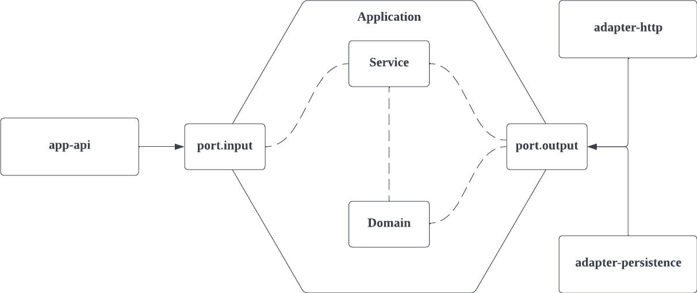

# 소개. Blog Service

- 블로그를 검색할 수 있는 서비스를 제공합니다.

# 환경 소개

- JAVA 17
- Spring Boot 2.7.3
- Gradle 기반 빌드
- H2 인메모리
- JUnit, MockMvc 기반 테스트 케이스 작성
- REST docs 기반 API 명세 작성

# 프로젝트 구성 소개

프로젝트 구성은 아래 디렉토리 구조를 참고합니다.

```
root
├── apps                  
│   └── app-api               - 블로그 API 스프링 어플리케이션
├── buildSrc                  - 의존성 버전 관리
├── commons                   - 공통 라이브러리 관리
│   └── protocol              - 서비스 공통 프로토콜
└── libs
    ├── adapter-http          - 외부 통신을 위한 HTTP 어댑터
    ├── adapter-persistence   - DB 통신을 위한 영속성 어댑터
    └── application           - 어플리케이션 서비스
```

# 모듈 설계

- 멀티 모듈로 구성되어 있습니다.
- 모듈 간 의존성은 각 모듈의 `build.gradle` 에서 관리되고 있으며 효율적으로 관리하기 위해 Line 에서 제공하는 [build-recipe-plugins](https://github.com/line/gradle-multi-project-support) 를 활용합니다. 
- Clean Architecture 에 기반한 모듈 설계와 패키지 의존 구조를 가지고 있습니다.



## module - application
- 도메인 엔티티, 입력 포트, 출력 포트, 그리고 서비스 로직이 포함되어 있습니다.
  - `domain`
  - `service`
  - `port/in`
  - `port/out`

## module - adapter

- 출력 포트에 대한 구현체가 포함되어 있습니다. 
  - `adapter-persistence` (jpa)
  - `adapter-http` (http-client)

## module - app

앱을 동작하기 위한 부분이 포함되어 있습니다.
- `app/app-api`

# API 명세
- `/apps/app-api/src/docs/index.adoc` 을 참고합니다.

# 실행하기
## 빌드 파일 만들기 (Executable Jar 만들기)
```
./gradlew clean :apps:app-api:build
```

## Executable Jar 실행하기
- `./apps/app-api/build/libs/` 디렉토리로 접근
- 아래 커맨드 실행
```
java -jar {jar_name}.jar
```

# 외부 라이브러리
## 개발 편의성
### [io.freefair.lombok](https://plugins.gradle.org/plugin/io.freefair.lombok)
- 어노테이션 및 코드 간결화를 위해 사용

### [com.google.guava](https://github.com/google/guava)
- Collection 과 관련된 유틸 메소드를 위해 사용

### [org.apache.commons](https://commons.apache.org/)
- Collection, String 등 유틸 메소드를 위해 사용

### [com.querydsl](http://querydsl.com/releases.html)
- JPA 를 좀 더 편하게 사용하기 위해 사용

### [org.mapstruct](https://mapstruct.org)
- 각 계층 간 객체 컨버팅을 편리하게 하기 위해 사용

## 빌드 편의성 
### [com.linecorp.build-recipe-plugin](https://plugins.gradle.org/plugin/com.linecorp.build-recipe-plugin)
- 멀티 모듈 환경에서 빌드 파일을 효율적으로 관리하기 위해 사용

## 테스트
### [com.coditory.integration-test](https://github.com/coditory/gradle-integration-test-plugin)
- 통합 테스트를 편리하게 하기 위해 사용

### [com.navercorp.fixturemonkey](https://naver.github.io/fixture-monkey/)
- 테스트 객체를 자동으로 생성하기 위해 사용 

### [org.junit.jupiter](https://junit.org/junit5/docs/current/user-guide/)
- JUnit 테스트를 위해 사용

### [org.assertj](https://mvnrepository.com/artifact/org.assertj/assertj-core)
- 테스트 코드의 가독성을 높이기 위해 사용

### [org.mockito](https://mvnrepository.com/artifact/org.mockito)
- 테스트 프레임워크 사용을 위해 사용

## API 명세 작성
### [com.epages.restdocs-api-spec](https://plugins.gradle.org/plugin/com.epages.restdocs-api-spec)
- REST docs 문서 작성을 위해 사용

### [org.asciidoctor.jvm.convert](https://asciidoctor.org/docs/asciidoctor-gradle-plugin/)
- API 명세 문서 snippet 을 생성하기 위해 사용
